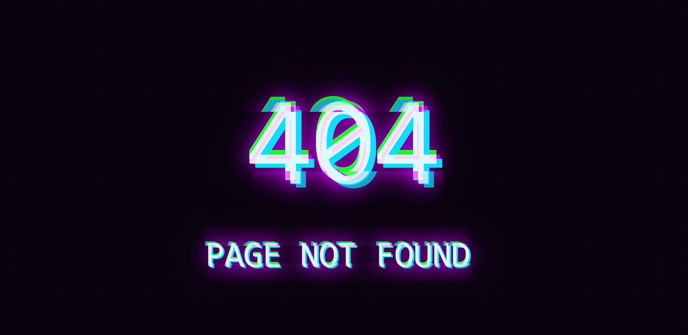

# Webspaces
All my websites in one repository

❗ This project does not represent my websites anymore. I am now using nextjs which bundels all of my websites including the webserver so I don't want to publish the code anymore!

## Demo
- <a href="http://frozenassassine.de">Portfolio</a>
- <a href="http://games.frozenassassine.de">Games</a>
- <a href="http://frozenassassine.de/invisiblecharacter/">Invisible Character</a>
- <a href="http://fastedit.frozenassassine.de">Fastedit</a>
- <a href="http://easepass.frozenassassine.de">Ease Pass</a>
- <a href="http://quicknav.frozenassassine.de">QuickNav</a>

### It also contains the "Work in Progress Glitch effect" and the "404 Glitch effect".

